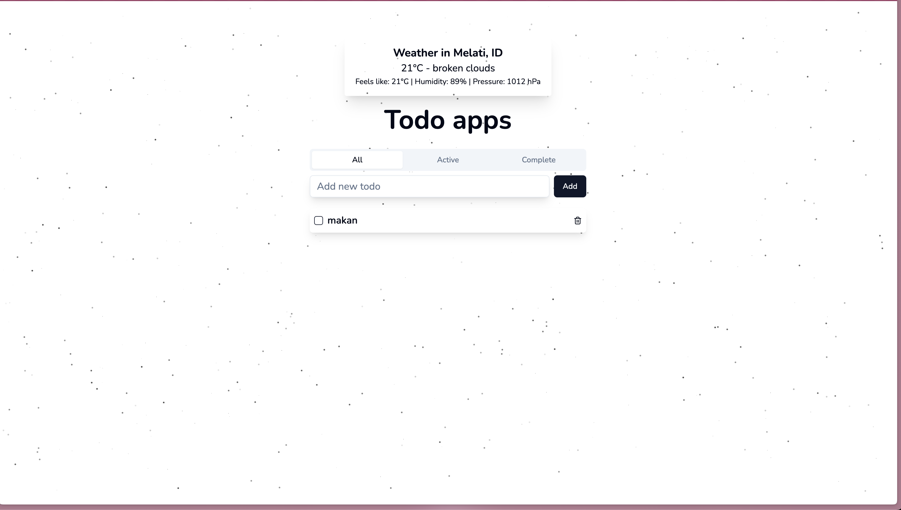

# Waizly Frontend Developer Technical Test

## Overview

This repository contains my submission for the Waizly Frontend Developer technical test. The test required the implementation of a simple ToDo application with specific features, as well as the option to add additional functionality for extra points.

## Project Structure

```bash
.
.
├── README.md                    # Project documentation
├── implementation-test-backend-2.txt # Answer for the Backend 2 task
├── todo-apps/                   # Implementation of the ToDo application
├── image/                       # Folder containing images
│   └── preview.png              # Preview image for the ToDo app
└── problem-solving/             # Solutions for the problem-solving tasks

```

## ToDo Application

The ToDo application is implemented using **[JavaScript Framework/Library/Vanilla JS]**. Below is a summary of the features implemented:

### Features Implemented

1. **Add, Edit, Delete Task/Todo**

   - Users can add new tasks, edit existing tasks, and delete tasks.

2. **Mark Task as Done/Completed**

   - Users can mark tasks as completed, and these tasks are visually distinguished from pending tasks.

3. **Animations**

   - Implemented animations when tasks are marked as done, deleted, or edited using [Framer Motion](https://www.framer.com/api/motion/).

4. **Search Bar**

   - Added a search bar that allows users to search for specific tasks in tab active and complete.

5. **Fetch Data from Public API**
   - Integrated a public API Weather API from [Open Weather](https://openweathermap.org/api).

## Problem-Solving Tasks

The `problem-solving/` directory contains my solutions to the problem-solving tasks. Each task is documented with explanations and code.

## Backend Task

The file `implementation-test-backend-2.txt` contains my answer for the Backend 2 implementation task, as required.

## Preview

<p>
  
</p>
